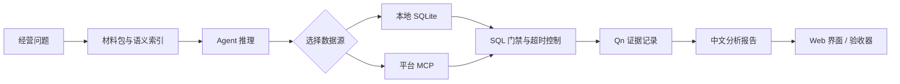

# 电商经营分析 Agent

> 把一句经营问题，变成有口径、有证据、能复核的分析报告。

[](https://www.python.org/)
[](https://vuejs.org/)
[](https://www.sqlite.org/)
[](#许可)

这是一个面向电商经营分析的 NL2SQL Agent 实验项目。用户可以问“销售为什么下降”“哪个活动值得继续”“今天该补哪些货”，Agent 会选择数据源、执行只读查询、遵守指标口径，并在报告中标出每个数字来自哪条查询。

项目使用构造的电商数据，不包含真实商户信息。它适合用来研究 Agent 的取数、语义层、证据链、失败恢复和评测方法。

## 项目亮点

- **语义层**：在 `data/ecommerce/mdl.yaml` 中登记指标、维度、粒度、版本和数据源，减少每次手写口径与 JOIN。
- **多源取数**：店铺交易数据通过本地 SQLite 查询，流量、广告、库存和财务等平台数据通过只读 MCP 查询。
- **证据链**：报告中的数字引用连续的 `Qn` 查询编号，保留 SQL、结果和口径，方便复核。
- **安全执行**：SQL 只读；单条查询默认 5 秒预算；超时会返回执行计划并要求改写，连续超时后进入人工审批，批准查询最多执行 60 秒。
- **可视化界面**：Vue 3 + ECharts 页面展示回答、查询证据、图表和待审批 SQL。
- **端到端 Benchmark**：`benchmarks/commerce_e2e/` 提供 5 个跨表经营任务、数据生成器、标准答案复核器和验收器。

## 工作流



## 目录

| 路径 | 内容 |
| --- | --- |
| `agent_loop.py` | Agent 主循环、工具调用、证据编号和报告输出 |
| `semantic/` | 指标注册表、查询规划、执行引擎、比率和归因计算 |
| `sql_control.py` | 只读 SQL、执行计划、超时取消、重试和审批状态机 |
| `web/` | Flask 服务入口和 API |
| `frontend/` | Vue 3 + ECharts 前端 |
| `data/ecommerce/` | 演示数据库、指标模型和技能卡 |
| `benchmarks/commerce_e2e/` | 端到端业务 Benchmark |
| `tools/` | 确定性验收、数据生成和本地调试脚本 |

## 快速开始

### 1. 安装依赖

```bash
git clone https://github.com/destire-mio/ecommerce-analysis-agent.git
cd ecommerce-analysis-agent

python3 -m venv .venv
source .venv/bin/activate
python -m pip install -r requirements.txt

cd frontend
npm install
npm run build
cd ..
```

### 2. 配置模型密钥

运行真实 Agent 需要 DeepSeek API 密钥。只通过环境变量传入，不要把密钥写进代码、配置文件或提交记录。

```bash
export DEEPSEEK_API_KEY="你的密钥"
```

### 3. 启动 Web 界面

```bash
python web/run.py
```

浏览器打开 `http://127.0.0.1:8000`，输入一个经营问题即可开始分析。也可以直接运行命令行入口：

```bash
python agent_loop.py \
  --question "比较最近两周销售额，告诉我下降最多的品类" \
  --db ecommerce \
  --bench ecommerce
```

### 4. 运行确定性验收

这些检查不调用外部模型，适合在改代码后快速回归：

```bash
python tools/run_semantic_acceptance.py
python tools/run_sql_budget_acceptance.py
python tools/run_compare_acceptance.py
```

前端构建检查：

```bash
npm --prefix frontend run build
```

`tools/run_release_gate.py` 还包含需要 API 密钥的 Web 和模型链路检查，不能用上面的无模型验收命令替代。

## Benchmark

端到端任务位于 [`benchmarks/commerce_e2e/`](benchmarks/commerce_e2e/)。5 条任务覆盖：

1. 销售下滑诊断
2. 活动贡献复盘
3. 预算约束下的补货
4. 新客复购分析
5. 经营销售额与财务到账对账

先阅读 [Benchmark 说明](benchmarks/commerce_e2e/README.md) 和 [业务口径](benchmarks/commerce_e2e/contract.md)。构造数据和运行产物默认被 `.gitignore` 排除，避免把大文件和本地轨迹提交到仓库。

```bash
python benchmarks/commerce_e2e/build.py \
  --out benchmarks/commerce_e2e/artifacts/demo \
  --orders 10000 \
  --seed 9142028

python benchmarks/commerce_e2e/oracle.py \
  benchmarks/commerce_e2e/artifacts/demo

python benchmarks/commerce_e2e/selfcheck.py \
  benchmarks/commerce_e2e/artifacts/demo
```

真实模型运行会消耗 API 额度；标准答案只由验收器读取，不会注入 Agent 提示词。

## 数据与边界

- `data/ecommerce/ecommerce.sqlite` 和 Benchmark 数据均为构造数据，用于开发和测试。
- Agent 当前面向本地 SQLite 与项目内的模拟 MCP 服务，不代表生产数据库已经具备高可用、权限隔离或容量保障。
- SQL 超时策略保护单条查询；一整个分析仍可能包含多条查询并超过 5 秒。
- 自动验收覆盖数值、引用和来源覆盖；因果解释仍需要人工审查，不能把一次运行当成所有场景通过。

## 参与开发

欢迎围绕指标口径、跨源血缘、查询性能、评测反例和前端体验提交 Issue 或 Pull Request。修改后请附上复现问题的命令和验收结果。

## 许可

仓库目前尚未声明开源许可证。代码可以公开查看，但在添加许可证前，请不要默认获得再发布或商用授权。
